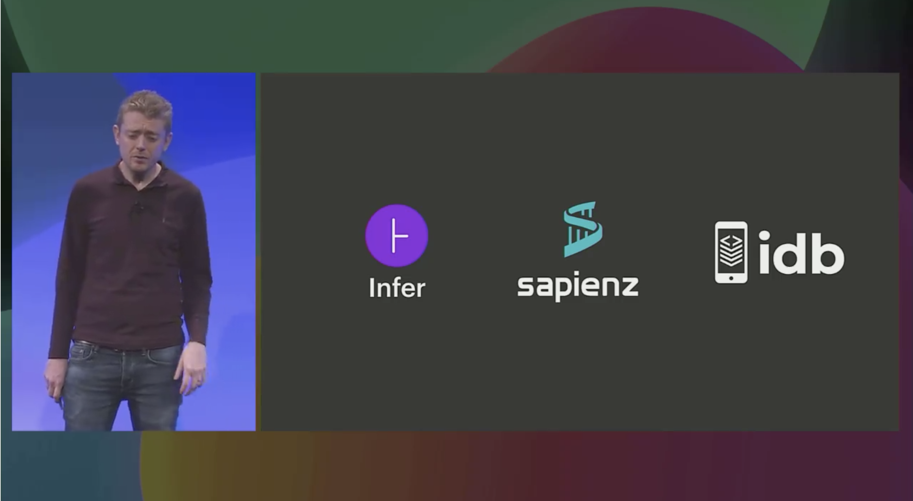
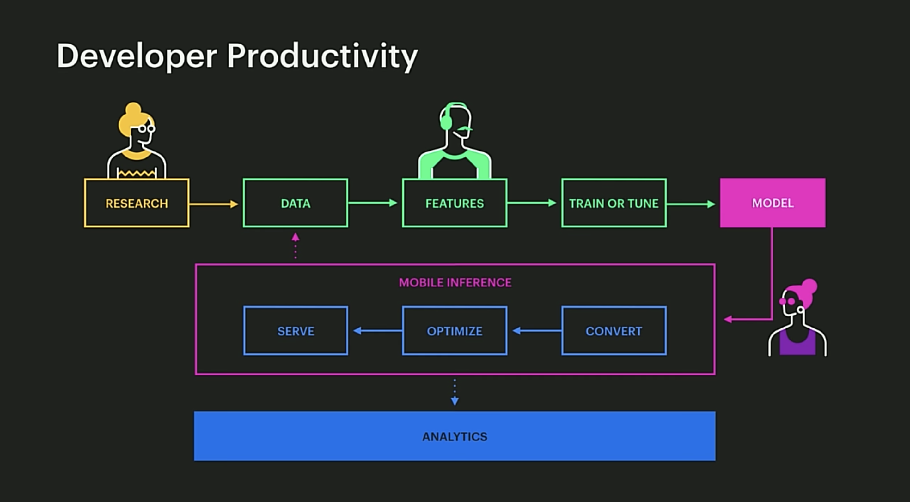

*(Originally posted on [PicCollage Blog](https://tech.pic-collage.com/developer-experience-at-any-scale-f28f0d52a8b1).)*

At [Facebook F8](https://f8.com), we heard first hand about everything Facebook has planned for the future — not only for its five major products but also across its open source projects. Instead of listing feature announcements, I want to talk about a concept called developer experience and what Facebook is doing to make their engineers more productive.

Developer experience is another way of talking about user experience when the user of a software or system is a developer. There are many ways to improve developer experience. It may be a script that automates a repetitive task, an efficient release process, or a well set-up CI/CD pipeline. Improving developer experience of your system can greatly improve your team’s productivity. Here’s a highlight of some of the things Facebook is doing across different teams to help their engineers.

# Reliable Code at Scale

 In the "Reliable Code at Scale" session, they talked about how Facebook uses Infer, Sapienz, and idb to help their developers write reliable code fast. Most engineers are familiar with the iteration cycle where they write some code, run tests, catch bugs, and then back to writing some more code. Going through these cycles can get tedious, so Facebook built some tools to help. For example, [Infer](https://fbinfer.com/) is a static analyzer that runs on every commit to automatically catch potential bugs on their iOS and Android apps. The two other tools mentioned in the talk, [Sapienz](https://code.fb.com/developer-tools/sapienz-intelligent-automated-software-testing-at-scale/) and [idb](https://github.com/facebook/idb), help orchestrate the test cases to different devices and simulators in their device farm. With these tools, each of the engineers' commits is automatically tested and checked for bugs, allowing the engineers to move faster without sacrificing quality.

# Third-party frameworks as investment to your team

Facebook's [ComponentKit](https://componentkit.org/) and [Litho](http://fblitho.com) are UI frameworks that were created to help Facebook engineers write UI code in a declarative, functional way. Some call frameworks like this intrusive and are hesitant use them in their codebase. It’s a valid concern because the frameworks are abstractions over the platform’s native code that everyone working on that codebase would need to learn. New engineers joining the team will either have to have prior experience working with the framework or need extra time to learn it.

Another way to look at it, however, is to evaluate the benefit of using the frameworks. Do they help your engineers write less code? Do they help your engineers write better, safer code? If adopting the framework means engineers can move faster confidently, then the investment in developer experience may be worth if for your team.

# Developer productivity in ML

In "Building a Mobile AI platform", they talked about automating the complicated and manual process involved in moving machine learning research into production on mobile. There are many constraints on running a machine learning model on a mobile device. We're often concerned about model size, performance, architecture, to name a few. Facebook helped build some of these automation into [PyTorch](https://pytorch.org/) to provide a more streamlined developer experience – including a model zoo, a benchmark suite, and a performance monitor that will help the engineers in this highly iterative process. 

# Build with accessibility in mind

Accessibility support is often a second thought when it comes to developing products and building features. When Facebook redesigned its facebook.com website, they also built a nifty tool that help developers improve the accessibility of the site. As Ashley Watkins, one of the speaker of the session, points out, “it’s easy to forget experiences that are not our own.”

Instead of relying on education and linters to prevent accessibility issues to occur, the tool visually highlights the element that do not properly support accessibility, as shown in the image above. The tool also provides context for the error, so that the engineers can quickly and efficiently solve the problem. 

# Help your engineers be awesome at their job

Facebook continues to invest in infrastructure so that their thousands of engineers can deliver new features safer and faster, while also providing consistently good user experience. These challenges are not limited to companies at Facebook’s scale — there are always opportunities to help your team be successful. As the mobile and machine learning teams grow at PicCollage, we’ll continue to streamline our development process so that we can empower our engineers to do the best work they could.

# Related sessions from F8

1. [Building the New facebook.com with React, GraphQL and Relay](https://www.facebook.com/FacebookforDevelopers/videos/1752210688215238/)
2. [Reliable Code at Scale](https://www.facebook.com/FacebookforDevelopers/videos/745584682502299/)
3. [Mobile Innovation with React Native, ComponentKit, and Litho](https://www.facebook.com/FacebookforDevelopers/videos/440768533157155/)
4. [Building a Mobile AI platform](https://www.facebook.com/FacebookforDevelopers/videos/2268314530087371/)